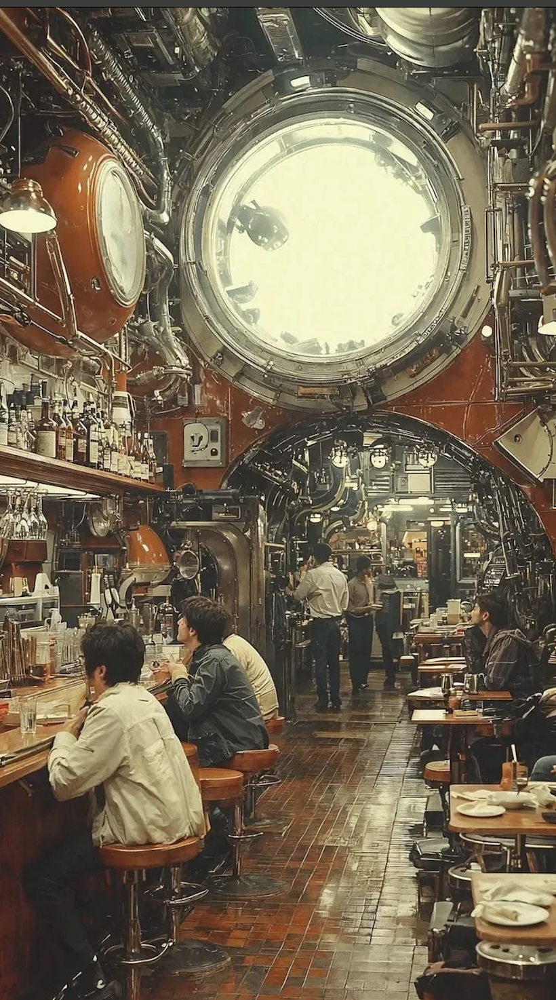

Ah. Another morning where, against my better judgement, I check my phone, open Instagram, and encounter a meme, or some sort of image. Whatever it is, it is almost certain I encounter something artificially generated; usually *piss filtered*[^1], cartoonish, hyperrealistic, yet imprecise.

[^1]: (artificial intelligence, slang) A usually undesired yellow tint commonly appearing in images produced by generative AI. [@wiktionary_piss_filter]

As I created this project, I wanted to ground my research in an almost indescribable feeling that never fails to beholden me every time I encounter an AI image. Words to describe such a feeling include: rage, discomfort, annoyance, and the main focus of this essay, a feeling of uncanny valley. This follows Mori's [@mori1970] in response to robots, i believe AI has a similar effect. I wondered if anyone else shared a similar experience, and Reddit threads confirm I am not alone [@ai_soulless]

### Case Studies

![The image has a uniform warm yellow cast that flattens the lighting across the scene. The central figure's face is rendered in high detail, the eyes in particular are sharp to the point of feeling uncanny, with a fixedness that real portrait photography rarely captures. The hair loses individual strand definition toward the edges, merging into a single textural mass rather than separating naturally. The foreground objects, the coffee cup, the stacked books, are rendered with a precision that reads as excessive. Real photography produces imperfection through focus, angle, and light. Here every object receives equal rendering attention regardless of its position in the frame. Behind the figure, two book covers contain legible titles. Every other spine on the shelves is a colored rectangle with no text. The model produced the visual density of a full bookstore without the content that would make it one. The incoherence is distributed across the background, where it is easy to miss on first glance.](man.png){width="300"}

![The brick texture on the exterior wall is rendered with uniform repetition, each brick receives the same level of detail and the same coloring, without the variation in tone and weathering that real masonry accumulates. The sidewalk has a similar quality, smooth and texturally consistent in a way that real concrete is not. The image has a slight graininess that reads as simulated film texture rather than natural photographic noise. The store name on the back wall, legible as something close to HACKNAROO, is typeset with the visual confidence of a real brand but means nothing. The letterforms are correct. The word is not.The interior is more convincing than the exterior. The coats on the mannequins, the shelving units, the track lighting are all rendered plausibly. But the items on the shelves do not resolve into specific objects, folded textiles, stacked boxes, leather goods rendered as category suggestions rather than particular things. The mannequins are headless.
The exterior and interior feel like they were produced separately and composited, with different levels of rendering fidelity on either side of the glass.](storefront.png){width="300"}

![The image is dense to the point of being difficult to parse. Pipes, gauges, valves, and industrial machinery cover every surface, each element rendered with photographic realism with none of it connected to a functional system. The machinery has no legible purpose. Individual components look like they belong in an engine room or a factory, but their arrangement follows no engineering logic. The large circular opening at the top of the frame emits pure white light with nothing visible beyond it, no exterior, no sky or source. The people seated at the bar are rendered with less detail than the surfaces around them, backgrounded by their own environment. The overall effect is of a space that could not exist but is rendered as though it does. Unlike obviously artificial images, this one sustains the appearance of photographic realism long enough that the incoherence accumulates gradually rather than registering immediately.](bar.png){width="300"}

![The rust, metal grain, and wood texture are rendered with high local fidelity. Every surface receives equal detail and equal weathering and there are no areas of concentrated wear that would indicate how the tool was actually used. The number "069" on the head and the symbol on the lower handle plate are formatted as a serial number and maker's mark respectively, but neither resolves into legible meaning. The background cave environment provides atmospheric context without any coherent spatial structure as the light source has no identifiable origin. The object is visually convincing at the level of individual surfaces but has no specificity as a particular tool with a particular history.](picaxe.png){width="300"}
```{=html}
<style>
  .gallery-wrap { padding: 1.5rem 0; font-family: var(--font-sans); }
  .gallery-intro { font-size: 15px; color: #666; margin-bottom: 2rem; line-height: 1.6; }
  .image-card { background: #fff; border: 0.5px solid #ddd; border-radius: 12px; overflow: hidden; margin-bottom: 2rem; }
  .image-card img { width: 100%; display: block; max-height: 380px; object-fit: cover; object-position: center top; }
  .image-label { padding: 0.75rem 1rem; border-top: 0.5px solid #ddd; }
  .image-label span { font-size: 12px; color: #999; text-transform: uppercase; letter-spacing: 0.08em; }
  .image-label p { font-size: 14px; color: #555; margin: 4px 0 0; line-height: 1.5; }
  .word-inputs { padding: 1rem; border-top: 0.5px solid #ddd; display: flex; gap: 8px; }
  .word-inputs input { flex: 1; font-size: 14px; padding: 6px 10px; border: 0.5px solid #ccc; border-radius: 6px; outline: none; }
  .word-inputs input:focus { border-color: #888; }
  .submit-row { padding: 0 1rem 1rem; display: flex; justify-content: flex-end; align-items: center; gap: 12px; }
  .submit-btn { font-size: 13px; padding: 6px 16px; cursor: pointer; border: 0.5px solid #ccc; border-radius: 6px; background: transparent; }
  .submit-btn:hover { background: #f5f5f5; }
  .success-msg { font-size: 13px; color: #888; display: none; }
  .cloud-section { border-top: 0.5px solid #ddd; padding: 1rem; display: none; }
  .cloud-label { font-size: 12px; color: #999; text-transform: uppercase; letter-spacing: 0.08em; margin-bottom: 0.75rem; }
  .cloud-canvas { width: 100%; height: 180px; position: relative; }
  .cloud-word { position: absolute; cursor: default; font-weight: 500; }
</style>

<div class="gallery-wrap">
  <p class="gallery-intro">Look at each of these images. Notice what you feel. We'll come back to why.</p>

  <div class="image-card">
    
    <div class="image-label"><span>Image 1</span><p>A man in a bookstore</p></div>
    <div class="word-inputs">
      <input type="text" placeholder="one word..." id="img1-w1" maxlength="30" />
      <input type="text" placeholder="one word..." id="img1-w2" maxlength="30" />
      <input type="text" placeholder="one word..." id="img1-w3" maxlength="30" />
    </div>
    <div class="submit-row">
      <span class="success-msg" id="success-1">submitted. thank you.</span>
      <button class="submit-btn" id="btn-1">submit</button>
    </div>
    <div class="cloud-section" id="cloud-1">
      <div class="cloud-label">what everyone said</div>
      <div class="cloud-canvas" id="canvas-1"></div>
    </div>
  </div>

  <div class="image-card">
    
    <div class="image-label"><span>Image 2</span><p>A boutique storefront</p></div>
    <div class="word-inputs">
      <input type="text" placeholder="one word..." id="img2-w1" maxlength="30" />
      <input type="text" placeholder="one word..." id="img2-w2" maxlength="30" />
      <input type="text" placeholder="one word..." id="img2-w3" maxlength="30" />
    </div>
    <div class="submit-row">
      <span class="success-msg" id="success-2">submitted. thank you.</span>
      <button class="submit-btn" id="btn-2">submit</button>
    </div>
    <div class="cloud-section" id="cloud-2">
      <div class="cloud-label">what everyone said</div>
      <div class="cloud-canvas" id="canvas-2"></div>
    </div>
  </div>

  <div class="image-card">
    
    <div class="image-label"><span>Image 3</span><p>A bar</p></div>
    <div class="word-inputs">
      <input type="text" placeholder="one word..." id="img3-w1" maxlength="30" />
      <input type="text" placeholder="one word..." id="img3-w2" maxlength="30" />
      <input type="text" placeholder="one word..." id="img3-w3" maxlength="30" />
    </div>
    <div class="submit-row">
      <span class="success-msg" id="success-3">submitted. thank you.</span>
      <button class="submit-btn" id="btn-3">submit</button>
    </div>
    <div class="cloud-section" id="cloud-3">
      <div class="cloud-label">what everyone said</div>
      <div class="cloud-canvas" id="canvas-3"></div>
    </div>
  </div>

  <div class="image-card">
    
    <div class="image-label"><span>Image 4</span><p>A pickaxe</p></div>
    <div class="word-inputs">
      <input type="text" placeholder="one word..." id="img4-w1" maxlength="30" />
      <input type="text" placeholder="one word..." id="img4-w2" maxlength="30" />
      <input type="text" placeholder="one word..." id="img4-w3" maxlength="30" />
    </div>
    <div class="submit-row">
      <span class="success-msg" id="success-4">submitted. thank you.</span>
      <button class="submit-btn" id="btn-4">submit</button>
    </div>
    <div class="cloud-section" id="cloud-4">
      <div class="cloud-label">what everyone said</div>
      <div class="cloud-canvas" id="canvas-4"></div>
    </div>
  </div>
</div>

<script>
const COLORS = ['#378ADD','#1D9E75','#D85A30','#D4537E','#BA7517','#533AB7','#639922','#E24B4A'];
const STORAGE_KEY_PREFIX = 'aislop-img';

function countWords(wordList) {
  const counts = {};
  wordList.forEach(w => {
    const clean = w.trim().toLowerCase();
    if (clean) counts[clean] = (counts[clean] || 0) + 1;
  });
  return counts;
}

function renderCloud(imgNum, wordList) {
  const section = document.getElementById('cloud-' + imgNum);
  const canvas = document.getElementById('canvas-' + imgNum);
  section.style.display = 'block';
  canvas.innerHTML = '';

  const counts = countWords(wordList);
  const entries = Object.entries(counts).sort((a,b) => b[1]-a[1]);
  if (entries.length === 0) return;

  const maxCount = entries[0][1];
  const minSize = 13;
  const maxSize = 42;
  const placed = [];
  const canvasW = canvas.offsetWidth || 580;
  const canvasH = 180;

  entries.forEach(([word, count], i) => {
    const size = Math.round(minSize + ((count - 1) / Math.max(maxCount - 1, 1)) * (maxSize - minSize));
    const color = COLORS[i % COLORS.length];
    const el = document.createElement('span');
    el.className = 'cloud-word';
    el.textContent = word;
    el.style.fontSize = size + 'px';
    el.style.color = color;
    el.style.opacity = '0';
    canvas.appendChild(el);

    const w = el.offsetWidth || word.length * size * 0.6;
    const h = size * 1.2;
    let x = 0, y = 0, attempts = 0, fits = false;

    while (attempts < 80 && !fits) {
      x = Math.random() * Math.max(canvasW - w, 0);
      y = Math.random() * Math.max(canvasH - h, 0);
      fits = placed.every(p => !(x < p.x + p.w + 6 && x + w + 6 > p.x && y < p.y + p.h + 4 && y + h + 4 > p.y));
      attempts++;
    }

    el.style.left = Math.round(x) + 'px';
    el.style.top = Math.round(y) + 'px';
    el.style.opacity = '1';
    placed.push({ x, y, w, h });
  });
}

async function submitWords(imgNum) {
  const w1 = document.getElementById('img' + imgNum + '-w1').value.trim().toLowerCase();
  const w2 = document.getElementById('img' + imgNum + '-w2').value.trim().toLowerCase();
  const w3 = document.getElementById('img' + imgNum + '-w3').value.trim().toLowerCase();
  const words = [w1, w2, w3].filter(w => w.length > 0);
  if (words.length === 0) return;

  const key = STORAGE_KEY_PREFIX + imgNum;
  const existing = localStorage.getItem(key);
  let wordList = existing ? JSON.parse(existing) : [];
  wordList = wordList.concat(words);
  localStorage.setItem(key, JSON.stringify(wordList));

  document.getElementById('img' + imgNum + '-w1').value = '';
  document.getElementById('img' + imgNum + '-w2').value = '';
  document.getElementById('img' + imgNum + '-w3').value = '';

  const msg = document.getElementById('success-' + imgNum);
  msg.style.display = 'inline';
  setTimeout(() => { msg.style.display = 'none'; }, 3000);

  renderCloud(imgNum, wordList);
}

document.getElementById('btn-1').addEventListener('click', () => submitWords(1));
document.getElementById('btn-2').addEventListener('click', () => submitWords(2));
document.getElementById('btn-3').addEventListener('click', () => submitWords(3));
document.getElementById('btn-4').addEventListener('click', () => submitWords(4));

function loadExistingClouds() {
  for (let i = 1; i <= 4; i++) {
    const existing = localStorage.getItem(STORAGE_KEY_PREFIX + i);
    if (existing) {
      const wordList = JSON.parse(existing);
      if (wordList.length > 0) renderCloud(i, wordList);
    }
  }
}

loadExistingClouds();
</script>
```

### Fluency Theory and Predictive Processing


Looking at these images, I want to ground my discomfort in something more than personal taste. It turns out, we can. There is a body of work in perceptual and cognitive science that explains what the brain is actually doing when it encounters a visual stimulus — and why some images feel wrong in ways that go beyond subjective preference. We can still hold the ethical critiques of AI image generation — the environmental cost of data centers, the exploitative nature of training data — while also arguing that the negative response to these images has a neurological basis that exists independently of those concerns.

Ramachandran and Hirstein propose eight laws of artistic experience, a set of heuristics that artists either consciously or unconsciously deploy to activate the visual areas of the brain. Three of these laws are especially relevant here: peak shift, perceptual grouping, and perceptual problem solving. What I want to show is that the images I'm examining fail all three simultaneously, and that this failure is what generates the feeling I described at the start.

### law 1 
The first law is peak shift. Consider the storefront image. At first glance it reads as a charming boutique — warm lighting, mannequins in coats, neatly folded merchandise. Look closer and the sign above the window reads something like "HACKNAROO." The image is vivid and heightened, clearly trying to evoke something, but it evokes nothing specific.
Ramachandran and Hirstein explain why through an animal learning experiment. If a rat is trained to distinguish a rectangle from a square and rewarded for picking the rectangle, it will respond even more strongly to a rectangle that is longer and skinnier than the original. The rat learned a rule — rectangularity — and more rectangle means better. Human visual processing works the same way. A caricature of Nixon is more viscerally Nixon than a photograph of Nixon because the cartoonist identified what makes his face distinct from all others and amplified those features. The result fires the relevant neurons harder than the real thing. This is discriminative amplification — the brain asking "what makes this this?" and getting a satisfying answer.

AI images amplify something different. Trained on massive datasets, they produce a supercharged version of the statistical average of a category. The storefront cranks up every feature associated with "charming boutique" in aggregate — the warm glow, the tasteful display, the brick exterior — without amplifying anything specific or essential. It is a caricature of a mean, not of a particular thing. The brain initiates the peak shift search, finds something that resembles a superstimulus, and then can't locate the discriminative logic underneath it. There is nothing to find. That gap between what the image promises neurologically and what it delivers is where the discomfort begins — and as we'll see with grouping and problem solving, it only compounds from there.

### law 3 

The bar image makes this failure vivid. At first glance it reads as a busy, atmospheric bar — stools, bottles lined up behind the counter, warm light, people sitting and standing. These elements cohere locally. Each one parses. But the space they occupy is physically impossible. The ceiling is a submarine hatch. The corridor curves like a pressure vessel. The architecture belongs to an entirely different category of structure than the one being depicted. It is simultaneously a bar and a submarine interior, and no amount of looking resolves that contradiction.

Ramachandran and Hirstein's third law explains why this feels bad rather than simply strange. One of the brain's primary jobs in vision is to find and delineate objects — to figure out what belongs together in the same physical world. When the brain successfully groups features into a coherent whole, that grouping is itself rewarding. It sends a signal to the limbic system before the object is even fully identified. This is why discovering the Dalmatian in a field of splotches produces a small but genuine sensation of pleasure — the moment those marks start cohering into a dog shape, you feel something, even mid-process. Coherence is pleasurable in its own right. Composition in art is essentially the artist deliberately engineering that coherence so the brain can experience the reward of finding it.

What makes AI images particularly insidious under this framework is that they don't fail immediately. The brain starts its grouping work and gets small hits of reward — the face coheres, the scene reads as a bar, the general category is legible. Those local successes are the problem, because they invite the brain to keep going, to look for the global coherence that should follow. But it doesn't come. The lighting doesn't match the shadows. The background objects don't follow physical logic. The figures don't relate to the space they occupy in any way that holds together. The parts never add up to a whole.

This is different from an image that is completely incoherent from the start — you would dismiss that immediately. AI images are coherent enough to keep the brain engaged in the grouping search, but not coherent enough to complete it. The reward keeps getting promised and never arriving. That loop of partial coherence with no resolution is another layer of the same sustained discomfort the peak shift failure initiated.

### law 5

Look at the pickaxe image. The tool itself reads clearly enough — worn metal, wooden handle, a cave environment behind it. But stamped into the head of the pickaxe is the number 069, and below that an embossed symbol that suggests a manufacturer's mark or serial designation. Your brain immediately asks why. Numbers on tools mean something. They are inventory markers, serial numbers, safety certifications. The brain initiates a search for the logic — what does 069 refer to, what system does this belong to — and finds nothing. The number is there because the model produced it, not because it means anything. The embossed details do the same thing. They read as significant and resolve into nothing.

Ramachandran and Hirstein's fifth law explains why this search feels compulsive rather than brief. The brain finds pleasure in resolving ambiguity — the struggle toward a solution is itself rewarding, provided the solution eventually arrives. Their example is the Dalmatian photograph, initially a field of random splotches that suddenly coheres into a dog. The moment of resolution generates genuine limbic activation. It feels good neurologically. A veiled figure is more alluring than a fully visible one for the same reason — partial concealment gives the brain something to work toward. The key condition is that the image has to be solvable. The struggle is only rewarding if it ends.

AI images structurally cannot satisfy this condition. The 069 stamp, the misaligned proportions, the details that suggest meaning without containing it — these all trigger the problem-solving mechanism and then offer no resolution. There is no underlying logic to discover because no one put any there. The brain doesn't shrug and move on. It keeps trying. This is what distinguishes the negative reaction to AI images from the discomfort of looking at a Picasso, which is also visually wrong in obvious ways. A Picasso eventually resolves — the eyes on one side of the face start to make sense as a representational choice, the distortion coheres around an emotional logic, the brain gets its reward. AI errors offer no equivalent resolution because they are not choices. They are failures, and the brain cannot tell the difference until it has already spent considerable effort trying to solve them.

That sustained effort with no payoff is the third layer of the same loop. Peak shift promises essence and delivers average. Grouping promises coherence and delivers local fragments. Problem solving promises resolution and delivers nothing. The discomfort you feel looking at these images is not one failure — it is three simultaneous ones, running in parallel, none of them exiting.

### other stuff 


Look at the bookstore man. The face registers immediately as a face. Your visual system has no trouble with that initial categorization — there is a person, they are sitting at a desk, there are bookshelves behind them. But something keeps not landing. The hair sits slightly wrong. The proportions of the face are almost right but not quite. The expression is legible as grumpy but the muscles producing it don't quite map onto how faces actually move. You keep looking and the image keeps almost cohering without ever fully doing so.

Reber, Schwarz and Winkielman offer a precise account of why this feels bad. Their core claim is that aesthetic experience is a function of processing dynamics — the more fluently a perceiver can process an object, the more positive their response. Crucially this is not a conscious judgment. The brain registers ease of processing and that ease is itself experienced as pleasant before any opinion has formed. They call this hedonic marking — fluency just feels good, automatically. The variables that produce it are things like symmetry, figure-ground contrast, and goodness of form — features that make an image easy to parse.

What AI images produce is a specific and damaging split between two levels of this processing. Local fluency — the face reads as a face, the bookstore reads as a bookstore, the individual elements parse correctly — is intact. But global fluency, the way those elements cohere into a scene that makes spatial and physical sense, is not. The processing starts smoothly, gets small positive signals from the local recognition, and then keeps hitting friction at the global level that never resolves. The brain is receiving conflicting information — fluency signals and disfluency signals simultaneously — and the result is neither the clean positive response of a fluent image nor the dismissal of a completely incoherent one. It is something more unsettling: a processing experience that promises ease and keeps withdrawing it.


### PREDICTION ERROR WITHOUT RESOLUTION 

Return to the bookstore man. The face-processing system activates immediately and completely — the brain recognizes a human face and begins generating predictions with great specificity. Not just "this is a face" but precise expectations about how the proportions should sit, how the hairline should meet the forehead, how the skin should move around the eyes. These are not casual expectations. The brain has spent a lifetime learning the statistical regularities of human faces and it applies that knowledge automatically and constantly. What happens next is that those predictions keep getting violated. The hairline is slightly wrong. The jaw doesn't sit right. The eyes are close but not quite. Each violation is small, but there are many of them, and none of them resolve.
Van de Cruys and Wagemans argue that this dynamic — prediction error followed by failed resolution — is precisely what generates sustained negative affect. Their framework, drawn from predictive coding models of visual perception, holds that the brain is fundamentally a prediction machine. At every level of visual processing it generates expectations about incoming stimuli, checks those expectations against what it actually receives, and flags the mismatches as prediction errors. Crucially, prediction errors are always initially negative. They signal that something in the brain's model of the world needs updating.

What converts that initial negativity into pleasure is resolution. Van de Cruys and Wagemans are explicit that this is why a Picasso works despite being visually wrong — the errors are structured, intentional, and ultimately resolvable. The broken face coheres around an emotional logic once you find it. The brain does its work and gets its reward. The transition from uncertainty to predictability is what generates the positive aesthetic response. It is not the error that feels good. It is the solving of it.

AI images cannot offer this. The bookstore man's facial violations are not choices with underlying logic. They are artifacts of a model that has never seen a face, only patterns extracted from images of faces. There is no structure underneath to discover. The brain cycles through the prediction-error loop and comes up empty, then cycles again. The negative affect that prediction error generates never gets converted into resolution. It stays.

This is measurable. Van de Cruys and Wagemans note amygdala activation in response to unresolvable prediction errors — the same region involved in threat detection and fear processing. Reber, Schwarz and Winkielman's psychophysiological work shows that disfluency produces activity in the corrugator muscle, the frowning muscle, before any conscious judgment has formed. The emotion is happening in your body before you have decided how you feel. The rage and discomfort you might notice scrolling past an AI image on Instagram are not oversensitivity or aesthetic snobbery. They are your threat-detection machinery responding to a genuine categorical violation — a face that pattern-matches to human but refuses to resolve into one.

### Benjamin and Aura

Look again at the bookstore man. He sits at a desk in a wood-paneled bookstore, a coffee cup in front of him, shelves of books behind him. He has the particular grumpiness of someone interrupted. He looks, in other words, like a person who was somewhere, doing something, when a photograph was taken. But he was not. There is no bookstore. There is no man. No one was there. Nothing was captured.
Walter Benjamin's concept of aura helps articulate why this matters beyond the neurological failures already described. For Benjamin, aura is the quality of presence that attaches to an authentic work — its unique existence in a particular time and place, the history embedded in it, the fact that it happened. A photograph carries aura not because it is beautiful but because it is indexical: it implies a there. Something stood in front of a lens. Someone decided to press a shutter. The image is evidence of an encounter between a camera and the world. Even a photograph of a mundane street corner, Benjamin writes, bears the trace of that moment — it is a scene of a crime, photographed to establish evidence of what was.

AI images have none of this. They are not photographs of things that existed. They are not paintings made by a hand that looked at something. They are statistical distributions rendered visible — the average of millions of images collapsed into a single output. The bookstore man is not a portrait of anyone. The bar is not a place. The figures sitting at the counter in that impossible submarine interior were never anywhere. No photographer composed that shot. No one decided that the warm light should fall that way. The image has the surface of a document but no document exists. It is aura without source.

This is a different register of wrongness from what Ramachandran and Hirstein, Reber, Schwarz and Winkielman, Van de Cruys and Wagemans, and Graf and Landwehr describe. Those failures are perceptual and cognitive — the brain's prediction machinery running loops it cannot exit. This failure is philosophical. It concerns what an image is allowed to claim about the world. A photograph of a bookstore claims that a bookstore existed. An AI image of a bookstore makes the same visual claim with nothing behind it. It is not a lie exactly, because it makes no explicit assertion. But it occupies the visual register of evidence while being empty of it — a document of nothing, signed by no one.


### SO why do people like AI?

If the negative reaction to AI images is neurological, why isn't it universal? There are subreddits with tens of thousands of members celebrating AI art. There are markets for it, buyers for it, people who share it enthusiastically and feel nothing of what this essay describes. This deserves an honest answer rather than a dismissal.

Reber, Schwarz and Winkielman offer part of the explanation. Fluency effects are moderated by prior exposure — familiarity with a stimulus style builds processing fluency for that style specifically. People who consume large quantities of AI images develop a kind of literacy for the aesthetic. The piss filter, the hyper-saturated warmth, the uncanny smoothness of AI skin — these become recognizable and therefore easier to process. The mere exposure effect doesn't make the images neurologically coherent, but it makes them feel more familiar, and familiarity registers as fluency.

Context provides another part. Someone sharing an AI meme on Reddit is not engaging with it as a depiction of something real. They are responding to its content, its humor, its category. The neurological failure modes this essay describes are most acute when the brain is treating an image as a genuine representation — when it activates face-processing systems, grouping heuristics, and prediction machinery in earnest. Passive scrolling at speed may never push far enough into controlled processing for the global disfluency to become apparent.

This essay's argument is strongest understood not as a universal law but as a claim about a specific kind of encounter — sustained, attentive looking at an AI image treated as a depiction of something. Under those conditions, the failures described here are systematic and predictable. Whether that encounter is common probably depends on how you use these images and what you expect from them.


### Conclusion


The frameworks assembled here — Ramachandran and Hirstein, Reber, Schwarz and Winkielman, Van de Cruys and Wagemans, Graf and Landwehr, Benjamin — all point toward the same structural conclusion: the negative reaction to AI images is not a matter of taste or cultural gatekeeping. It is the predictable output of perceptual and cognitive systems encountering images that promise coherence and repeatedly withhold it, documents that claim presence while containing none.

But this raises a question that none of these frameworks fully answers. If the failures described here are technical — the wrong number of fingers, the impossible architecture, the nonsense sign — then they are in principle fixable. Models are already improving. The hands are getting better. The spaces are becoming more physically coherent. Alice Helliwell, writing on the aesthetics of AI art, notes precisely this: as AI systems improve, the distinctive weirdness of their outputs diminishes. The norm violations become subtler, the uncanny valley narrows, the failure becomes harder to locate. A more recent version of Stable Diffusion produces fewer obviously broken images than its predecessors.
So the open question is whether fixing the technical failures fixes the problem this essay describes. If the bar image had consistent architecture, if the bookstore man's face resolved properly, if the pickaxe stamp meant something — would the negative reaction disappear? The neurological and cognitive frameworks suggest it might. The local and global fluency would align, the prediction errors would resolve, the grouping would cohere. The brain would get its rewards.

But Benjamin suggests otherwise. Even a technically perfect AI image would remain a document of nothing, signed by no one. The aura problem is not a rendering problem. It cannot be solved by a better model. The bookstore man could have perfect proportions and still never have existed, still have been captured by no camera, still occupy a space that was never anywhere. Whether that absence is legible to a viewer who does not know to look for it is a different question. Whether it matters aesthetically if it is not legible is a different question still.
These are the questions that will become more pressing as the technical failures recede. For now, the seven-fingered hand makes them easy to avoid.
